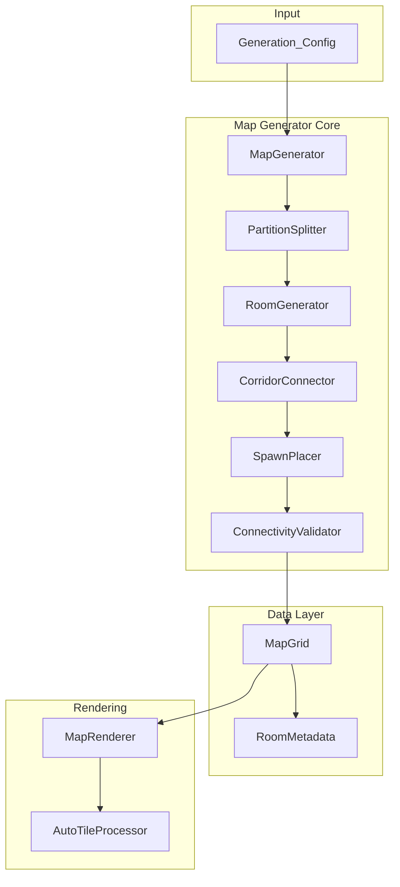
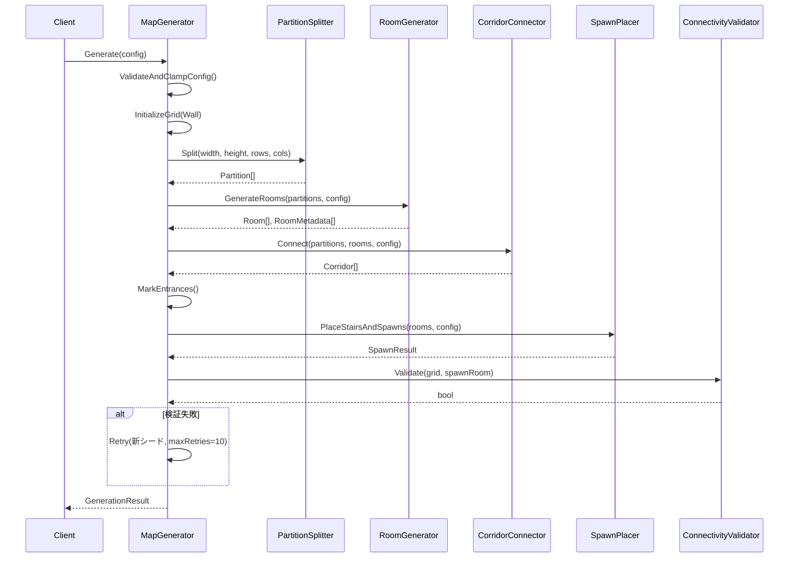
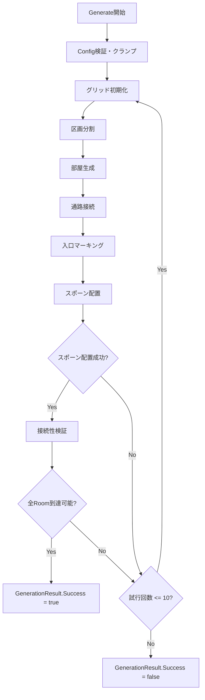

# Design Document: ローグライクマップ生成

## Overview

本設計は、区画割法（Grid Split）アルゴリズムによる不思議のダンジョン系マップ生成システムを定義する。システムは以下の3層で構成される:

1. **Map Generator Core** — 2Dタイルグリッドとしてダンジョンを生成するアルゴリズムエンジン
2. **Map Grid Data Structure** — 生成結果を保持し、ゲームプレイ・描画システムに提供するデータ層
3. **Map Renderer** — Map_Gridを3Dジオメトリとして描画するOpenGLベースの描画層

技術スタック:
- C# / .NET 10
- Silk.NET 2.23.0 (OpenGL 3.3 Core Profile)
- テスト: xUnit + FsCheck（プロパティベーステスト）

設計方針:
- 生成ロジックは描画から完全に分離し、単体テスト可能とする
- `Generation_Config`による全パラメータの外部化で、コード変更なしのイテレーションを実現
- シード値による決定論的生成で、バグ再現とリグレッションテストを容易にする

## Architecture

### システム全体アーキテクチャ



### 生成パイプライン



### レイヤー間の依存関係

- **Map Generator Core** → 外部依存なし（純粋なアルゴリズム層）
- **Data Layer** → 外部依存なし（POCOデータ構造）
- **Rendering** → Silk.NET/OpenGL、Data Layer

この分離により、生成ロジックのユニットテストを描画なしで高速に実行できる。

## Components and Interfaces

### 1. Generation_Config

```csharp
public sealed class GenerationConfig
{
    // マップ寸法
    public int MapWidth { get; init; } = 60;        // 20～200
    public int MapHeight { get; init; } = 40;       // 20～200

    // グリッド分割
    public int GridRows { get; init; } = 3;         // 1～10
    public int GridColumns { get; init; } = 3;      // 1～10

    // 部屋サイズ
    public int MinRoomWidth { get; init; } = 5;     // 5～50
    public int MinRoomHeight { get; init; } = 5;    // 5～50
    public int MaxRoomWidth { get; init; } = 15;    // MinRoomWidth～(PartitionWidth - 2)
    public int MaxRoomHeight { get; init; } = 15;   // MinRoomHeight～(PartitionHeight - 2)

    // 確率パラメータ
    public float EmptyPartitionChance { get; init; } = 0.1f;   // 0.0～1.0
    public float CorridorPruneChance { get; init; } = 0.0f;    // 0.0～1.0
    public float MonsterHouseChance { get; init; } = 0.0f;     // 0.0～1.0

    // モード
    public bool BigRoomMode { get; init; } = false;
    public bool MonsterHouseEnabled { get; init; } = false;

    // シード
    public uint? Seed { get; init; } = null;        // null = 自動生成

    // スポーン
    public int InitialMonsterCount { get; init; } = 5;
}
```

### 2. MapGenerator（ファサード）

```csharp
public sealed class MapGenerator
{
    public GenerationResult Generate(GenerationConfig config);
}

public sealed class GenerationResult
{
    public bool Success { get; init; }
    public string? FailureReason { get; init; }
    public MapGrid? Grid { get; init; }
    public IReadOnlyList<RoomMetadata>? Rooms { get; init; }
    public uint UsedSeed { get; init; }
    public Vector2Int? PlayerSpawn { get; init; }
    public Vector2Int? StairsPosition { get; init; }
    public IReadOnlyList<Vector2Int>? MonsterSpawns { get; init; }
}
```

### 3. PartitionSplitter

```csharp
public sealed class PartitionSplitter
{
    /// <summary>
    /// マップ領域を rows×cols のグリッドに等分割する。
    /// 最小Partition幅/高さ(9)を満たせない場合、行数/列数を自動削減する。
    /// 割り切れない余剰はグリッド端部のPartitionに加算する。
    /// </summary>
    public PartitionGrid Split(int mapWidth, int mapHeight, int rows, int cols);
}

public readonly struct Partition
{
    public int X { get; init; }
    public int Y { get; init; }
    public int Width { get; init; }
    public int Height { get; init; }
    public int Row { get; init; }
    public int Col { get; init; }
}

public sealed class PartitionGrid
{
    public int Rows { get; }
    public int Columns { get; }
    public Partition this[int row, int col] { get; }
    public IEnumerable<Partition> All { get; }
}
```

### 4. RoomGenerator

```csharp
public sealed class RoomGenerator
{
    /// <summary>
    /// 各Partitionに対してランダムサイズのRoomを生成する。
    /// 空き区画確率に基づきスキップするが、最低2部屋を保証する。
    /// </summary>
    public RoomGenerationResult GenerateRooms(
        PartitionGrid partitions,
        GenerationConfig config,
        Random rng);
}

public readonly struct Room
{
    public int X { get; init; }
    public int Y { get; init; }
    public int Width { get; init; }
    public int Height { get; init; }
    public int PartitionRow { get; init; }
    public int PartitionCol { get; init; }
}

public sealed class RoomMetadata
{
    public Room Room { get; init; }
    public bool IsHiddenRoom { get; set; }
    public bool IsMonsterHouse { get; set; }
    public float ItemDensityMultiplier { get; set; } = 1.0f;
    public float MonsterDensityMultiplier { get; set; } = 1.0f;
}
```

### 5. CorridorConnector

```csharp
public sealed class CorridorConnector
{
    /// <summary>
    /// 隣接Partition間のRoom同士を通路で接続する。
    /// 通路間引き確率に基づきランダムに省略する。
    /// 通路がRoom領域を横断しないようルーティングする。
    /// </summary>
    public CorridorResult Connect(
        PartitionGrid partitions,
        IReadOnlyList<Room> rooms,
        GenerationConfig config,
        Random rng);
}

public readonly struct Corridor
{
    public IReadOnlyList<Vector2Int> Path { get; init; }
    public int SourceRoomIndex { get; init; }
    public int TargetRoomIndex { get; init; }
}
```

### 6. ConnectivityValidator

```csharp
public sealed class ConnectivityValidator
{
    /// <summary>
    /// プレイヤースポーンRoomから4方向隣接の探索を行い、
    /// すべての非隠しRoomに到達可能かを検証する。
    /// </summary>
    public bool Validate(MapGrid grid, IReadOnlyList<RoomMetadata> rooms, Vector2Int startTile);
}
```

### 7. MapRenderer

```csharp
public sealed class MapRenderer : IDisposable
{
    public MapRenderer(GL gl, float tileSize = 1.0f);

    /// <summary>
    /// MapGridから3Dメッシュを構築する。
    /// </summary>
    public void BuildMesh(MapGrid grid);

    /// <summary>
    /// 構築済みメッシュを描画する。
    /// </summary>
    public void Render(Matrix4x4 viewProjection);
}
```

### 8. AutoTileProcessor

```csharp
public sealed class AutoTileProcessor
{
    /// <summary>
    /// 指定位置のWallタイルに対し、周囲8タイルを検査して壁バリアントを決定する。
    /// マップ境界外は仮想Wallとして扱う。
    /// </summary>
    public WallVariant DetermineVariant(MapGrid grid, int x, int y);
}

public enum WallVariant
{
    None,           // 壁として描画不要（周囲が全てWall）
    Straight,       // 直線壁
    InnerCorner,    // 内角
    OuterCorner,    // 外角
    End,            // 行き止まり端
}
```

## Data Models

### TileType 列挙型

```csharp
public enum TileType : byte
{
    Wall = 0,
    Floor = 1,
    Corridor = 2,
    RoomEntrance = 3,
    StairsDown = 4,
}
```

### MapGrid

```csharp
public sealed class MapGrid
{
    private readonly TileType[,] _tiles;

    public int Width { get; }
    public int Height { get; }

    public MapGrid(int width, int height)
    {
        Width = width;
        Height = height;
        _tiles = new TileType[width, height];
        // 初期値: すべてWall (TileType.Wall = 0)
    }

    public TileType this[int x, int y]
    {
        get => _tiles[x, y];
        set => _tiles[x, y] = value;
    }

    /// <summary>
    /// 指定座標がグリッド内かを判定する。
    /// </summary>
    public bool InBounds(int x, int y)
        => x >= 0 && x < Width && y >= 0 && y < Height;

    /// <summary>
    /// 指定座標のタイルが通行可能（Floor, Corridor, RoomEntrance, StairsDown）かを判定する。
    /// </summary>
    public bool IsPassable(int x, int y)
        => InBounds(x, y) && this[x, y] != TileType.Wall;

    /// <summary>
    /// 境界外をWallとして扱い、タイルを取得する（Auto_Tile_Processor用）。
    /// </summary>
    public TileType GetTileOrWall(int x, int y)
        => InBounds(x, y) ? this[x, y] : TileType.Wall;
}
```

### Vector2Int

```csharp
public readonly record struct Vector2Int(int X, int Y)
{
    public static Vector2Int operator +(Vector2Int a, Vector2Int b)
        => new(a.X + b.X, a.Y + b.Y);

    public static readonly Vector2Int Up = new(0, -1);
    public static readonly Vector2Int Down = new(0, 1);
    public static readonly Vector2Int Left = new(-1, 0);
    public static readonly Vector2Int Right = new(1, 0);

    public static readonly Vector2Int[] FourDirections = { Up, Down, Left, Right };
    public static readonly Vector2Int[] EightDirections =
    {
        Up, Down, Left, Right,
        new(-1, -1), new(1, -1), new(-1, 1), new(1, 1)
    };
}
```

### タイル割り当て優先順位

Requirement 5.7で定義されたタイル上書きルール:

```
Wall → Floor → Corridor → Room_Entrance → Stairs_Down
```

後続の割り当てが前の値を上書きする。MapGeneratorは生成パイプラインの順序でこのルールを自然に満たす:
1. 全セルをWallで初期化
2. Room内セルにFloorを設定
3. 通路セルにCorridorを設定
4. Room壁面貫通位置にRoom_Entranceを設定
5. 最後にStairs_Downを配置


## Correctness Properties

*正当性プロパティとは、システムのすべての有効な実行において成立すべき特性・振る舞いのことである。人間が読める仕様と機械的に検証可能な正当性保証の橋渡しとなる形式的な記述である。*

### Property 1: 区画分割によるマップ完全被覆

*任意の*有効なマップ寸法(width, height)とグリッド分割数(rows, cols)に対して、PartitionSplitterが生成するすべてのPartitionの合計面積はwidth×heightと一致し、かつ任意の2つのPartitionの領域が重複せず、マップ領域全体に隙間が存在しないこと。さらに余剰タイルはグリッド端部（最終行・最終列）のPartitionに加算されていること。

**Validates: Requirements 1.1, 1.4**

### Property 2: 最小Partition寸法保証

*任意の*Generation_Configに対して、PartitionSplitterが出力するすべてのPartitionは幅9タイル以上かつ高さ9タイル以上であること。マップ寸法が要求されたグリッド分割数をサポートできない場合、実際の行数・列数が自動削減されること。

**Validates: Requirements 1.2, 1.3**

### Property 3: 部屋寸法・マージン制約

*任意の*生成されたRoomに対して、そのRoomは所属するPartitionの境界から全辺で最低1タイルのマージンを持ち、かつRoomの幅はGeneration_Configの最小部屋幅以上・最大部屋幅以下、高さは最小部屋高さ以上・最大部屋高さ以下であること。

**Validates: Requirements 2.2, 2.3**

### Property 4: 最低部屋数保証

*任意の*Generation_Config（空き区画確率0.0～1.0のいずれの値でも）に対して、生成されるMap_Gridには最低2つのRoomが存在すること。

**Validates: Requirements 2.6, 2.7**

### Property 5: 通路の構造的整合性

*任意の*生成されたCorridorに対して、(a) 経路は直線またはL字型（最大1回の方向転換）であること、(b) 起点はRoom壁面の角タイルを除いた位置であること、(c) 経路上の全タイルがいずれのRoom領域とも重複しないこと。

**Validates: Requirements 3.2, 3.3, 3.6**

### Property 6: 通路間引きなし時の完全接続

*任意の*CorridorPruneChance=0.0のGeneration_Configに対して、グリッド上で水平・垂直に隣接し共にRoomを含むすべてのPartitionペアの間にCorridorが存在すること。

**Validates: Requirements 3.1**

### Property 7: 隠し部屋フラグの整合性

*任意の*生成されたマップにおいて、Corridor接続が0本のRoomはすべてIsHiddenRoom=trueであり、1本以上のCorridor接続を持つRoomはすべてIsHiddenRoom=falseであること。

**Validates: Requirements 3.5**

### Property 8: 部屋入口タイルの正当性

*任意の*生成されたマップにおいて、(a) 各Corridor-Room接続ごとに正確に1つのRoom_Entranceタイルが、Corridorが接触するRoom壁面セル位置に配置されていること、(b) すべての非隠しRoomに最低1つのRoom_Entranceタイルが存在すること。

**Validates: Requirements 4.1, 4.2, 4.3, 5.4**

### Property 9: タイルタイプ整合性

*任意の*生成されたマップにおいて、(a) 各Room内部の全セルはFloor・Room_Entrance・StairsDownのいずれかであること、(b) Room外部の通路セルはすべてCorridorタイプであること、(c) Map_Gridの寸法はGeneration_Configのマップ幅・高さと一致すること、(d) StairsDownタイルが正確に1つ存在すること。

**Validates: Requirements 5.1, 5.2, 5.3, 5.6**

### Property 10: パラメータクランプの正当性

*任意の*範囲外の値を含むGeneration_Configに対して、実効パラメータはすべて定義された有効範囲内にクランプされ、クランプされた値は元の値に最も近い境界値であること。

**Validates: Requirements 8.1, 8.2**

### Property 11: シード決定論性

*任意の*シード値に対して、同一のGeneration_Configと同一シードで2回生成を実行した場合、出力されるMap_Gridは完全に同一であること。

**Validates: Requirements 8.3**

### Property 12: スポーン配置制約

*任意の*正常に生成されたマップにおいて、(a) StairsDownタイルは最低1つのCorridor接続を持つRoom内に配置されていること、(b) プレイヤースポーンはStairsDown Roomとは異なる非隠しRoom（最低1つのCorridor接続を持つ）内に配置されていること。

**Validates: Requirements 9.1, 9.2**

### Property 13: モンスター初期配置の分散

*任意の*InitialMonsterCountと対象Room集合に対して、プレイヤースポーンRoom以外の各非隠しRoomに最低1体のモンスターが配置され、合計配置数がInitialMonsterCountと一致すること。

**Validates: Requirements 9.3, 9.5**

### Property 14: マップ接続性保証

*任意の*正常に生成されたマップにおいて、プレイヤースポーン位置から4方向隣接（Floor・Corridor・Room_Entrance）の探索により、すべての非隠しRoomの少なくとも1タイルに到達可能であること。

**Validates: Requirements 10.1**

### Property 15: モンスターハウス数の制約

*任意の*MonsterHouseEnabled=trueのGeneration_Configに対して、モンスターハウスとして指定されるRoomの数は1以上3以下であり、指定されたすべてのRoomのItemDensityMultiplierとMonsterDensityMultiplierが3.0であること。

**Validates: Requirements 6.1, 6.3**

### Property 16: 大部屋モードのタイル制約

*任意の*BigRoomMode=trueのGeneration_Configに対して、生成されたMap_GridにはCorridorタイルおよびRoom_Entranceタイルが存在せず、壁ボーダーを除くすべてのセルがFloorまたはStairsDownであること。

**Validates: Requirements 6.2, 6.5**

### Property 17: オートタイル壁バリアント決定の整合性

*任意の*MapGrid上のWallタイル位置(x, y)に対して、AutoTileProcessorが返すWallVariantは周囲8タイルの非Wallタイルの方向パターンのみに依存し、マップ境界外は仮想Wallとして扱われること。同一の周囲パターンに対しては常に同一のバリアントが返されること。

**Validates: Requirements 7.3, 7.4**

## Error Handling

### 生成失敗

| エラー条件 | 対処 |
|---|---|
| 接続性検証失敗 | 新しいランダムステートで再生成（最大10回） |
| プレイヤースポーン配置条件を満たすRoomなし | 新しいランダムステートで再生成 |
| 再生成試行回数10回超過 | `GenerationResult.Success = false`、`FailureReason`に理由を設定して返却 |

### パラメータ検証

| 異常パラメータ | 対処 |
|---|---|
| 範囲外の値 | 最も近い有効境界値にクランプして生成続行 |
| MinRoomSize > MaxRoomSize | MaxRoomSizeをMinRoomSizeに引き上げ |
| マップ寸法不足 | グリッド行数/列数を自動削減 |

### 生成パイプラインのエラーフロー



## Testing Strategy

### テストフレームワーク

- **ユニットテスト**: xUnit
- **プロパティベーステスト**: FsCheck (C#バインディング)
- **PBT最小実行回数**: 各プロパティテスト100回以上

### テスト構成

```
FF11Dungeon.Tests/
├── Unit/
│   ├── PartitionSplitterTests.cs
│   ├── RoomGeneratorTests.cs
│   ├── CorridorConnectorTests.cs
│   ├── SpawnPlacerTests.cs
│   ├── ConnectivityValidatorTests.cs
│   ├── AutoTileProcessorTests.cs
│   └── GenerationConfigTests.cs
├── Properties/
│   ├── PartitionProperties.cs      -- Property 1, 2
│   ├── RoomProperties.cs           -- Property 3, 4
│   ├── CorridorProperties.cs       -- Property 5, 6, 7
│   ├── EntranceProperties.cs       -- Property 8
│   ├── TileIntegrityProperties.cs  -- Property 9
│   ├── ConfigProperties.cs         -- Property 10, 11
│   ├── SpawnProperties.cs          -- Property 12, 13
│   ├── ConnectivityProperties.cs   -- Property 14
│   ├── SpecialRoomProperties.cs    -- Property 15, 16
│   └── AutoTileProperties.cs       -- Property 17
└── Integration/
    └── FullGenerationTests.cs
```

### プロパティベーステスト方針

各プロパティテストは以下の形式で実装する:

```csharp
[Property(MaxTest = 100)]
// Feature: roguelike-map-generation, Property 1: 区画分割によるマップ完全被覆
public Property PartitionsCoverEntireMap()
{
    return Prop.ForAll(
        GenValidConfig(),
        config =>
        {
            var splitter = new PartitionSplitter();
            var result = splitter.Split(config.MapWidth, config.MapHeight, config.GridRows, config.GridColumns);
            // Assert: 合計面積 == マップ面積, 重複なし, 隙間なし
        });
}
```

### ユニットテスト方針

プロパティテストで網羅しきれない具体的なシナリオに集中:
- 大部屋モード + モンスターハウス有効時の組み合わせ動作
- 再生成10回超過時の失敗結果
- シード未指定時の自動生成と再現性
- 境界値（マップ幅20、部屋最小5等）の具体的確認
- Room_Entranceタイルの通行可能性判定

### カスタムジェネレーター

FsCheckで使用するカスタムArbitraryジェネレーター:

- `GenValidConfig()` — 有効範囲内のGenerationConfig生成
- `GenOutOfRangeConfig()` — 範囲外値を含むConfig（クランプテスト用）
- `GenMapGrid(int width, int height)` — ランダムなタイル配置のMapGrid
- `GenWallNeighborPattern()` — 8方向のWall/非Wallパターン（オートタイルテスト用）

